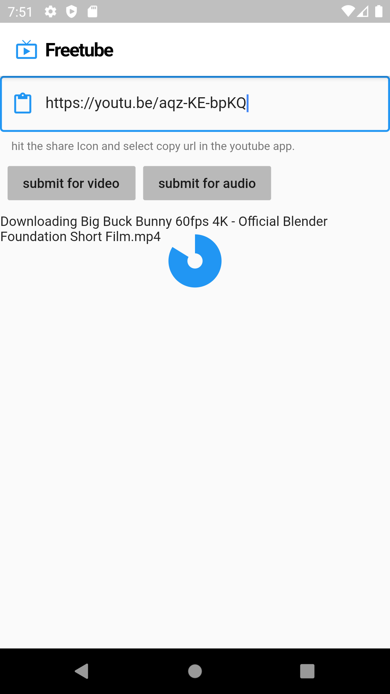

# freetube

A new Flutter application that downloads video or audio from youtube most of the credit goes to 
https://github.com/Hexer10/youtube_explode_dart
where they did most of the heavy lifting i just wrote a front end basically.

## Getting Started

[Download](https://github.com/silverfox983/Freetube/blob/master/build/app/outputs/apk/release/app-release.apk)

you will need android 7.0 or greater

